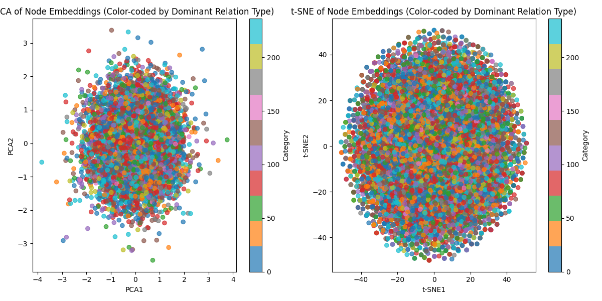

# Graph Transformer for Link Prediction on FB15k-237 Dataset

This repository implements a **Graph Transformer** model for link prediction tasks on the multi-relational FB15k-237 dataset. The project evaluates the impact of various positional encoding (PE) methods, including Laplacian PE (LapPE), Shortest-Path PE (SPPE), Random-Walk PE (RWPE), and Weisfeiler-Lehman PE (WL-PE).

## Features

- Implementation of **Graph Transformers** with multi-head attention and feed-forward layers.
- Support for multiple **positional encoding techniques**:
  - Laplacian PE (LapPE)
  - Shortest-Path PE (SPPE)
  - Random-Walk PE (RWPE)
  - Weisfeiler-Lehman PE (WL-PE)
- Training with **negative sampling** and evaluation using:
  - Mean Reciprocal Rank (MRR)
  - Hits@k (k = 1, 3, 10)
  - Area Under Curve (AUC)
- Visualization of:
  - **Attention score distributions**
  - **Node embeddings** using PCA and t-SNE.

## Setup and Installation

### Requirements

- Python 3.7+
- PyTorch 2.4.0
- DGL (Deep Graph Library)
- Additional libraries: `scikit-learn`, `matplotlib`

## Dataset

This project uses the **FB15k-237 dataset**, a benchmark for multi-relational link prediction tasks. It is automatically downloaded and preprocessed using the `DGL` library.

---

## Model Architecture

The **Graph Transformer** consists of:

- **Multi-Head Attention (MHA)**: Captures structural dependencies using relation-specific attention.
- **Feed-Forward Layers (FFN)**: Non-linear transformations to enhance feature representations.
- **Edge Feature Enricher**: Augments edge information using learned embeddings and scalar features.

---

## Positional Encodings

The following PEs are implemented to enhance structural awareness:

1. **Laplacian PE**: Encodes global smoothness using eigenvectors of the graph Laplacian.
2. **Shortest-Path PE (SPPE)**: Encodes proximity between nodes using shortest-path distances.
3. **Random-Walk PE (RWPE)**: Captures graph connectivity using k-step random walk probabilities.
4. **Weisfeiler-Lehman PE (WL-PE)**: Refines node labels iteratively, inspired by the Weisfeiler-Lehman graph isomorphism test.

---
## Key Configurable Parameters

- **Number of layers, heads, and hidden dimensions.**
- **Choice of positional encoding** (LapPE, SPPE, RWPE, WL-PE).
- **Negative sampling ratio and early stopping criteria.**

---
## Metrics

The following metrics are calculated during training and evaluation:

- **MRR** (Mean Reciprocal Rank)
- **Hits@k** (k = 1, 3, 10)
- **AUC** (Area Under the Curve)

---

## Results

### Key Findings

Key findings from the FB15k-237 dataset:

- **WL-PE** achieves the highest MRR, Hits@3, and Hits@10, demonstrating superior performance.
- A combination of **LapPE + SPPE** offers a scalable alternative with competitive results.
- Positional encodings significantly improve link prediction performance compared to models without PE.

### Performance Comparison

| **Method**        | **MRR**  | **Hits@1** | **Hits@3** | **Hits@10** | **AUC**   |
|--------------------|----------|------------|------------|-------------|-----------|
| No PE             | 0.2574   | 0.2049     | 0.2420     | 0.3333      | 0.5063    |
| LapPE             | 0.4452   | 0.2764     | 0.5409     | 0.7696      | 0.8742    |
| SPPE              | 0.4309   | 0.3010     | 0.4945     | 0.6653      | 0.7768    |
| LapPE + SPPE      | 0.4629   | **0.3086**     | 0.5503     | 0.7499      | 0.8519    |
| RWPE              | 0.4355   | 0.2633     | 0.5312     | 0.7691      | 0.8731    |
| **WL-PE**         | **0.4646** | 0.3047    | **0.5584** | **0.7696**  | 0.8348    |

---

## Visualization

Visualize node embeddings and attention score distributions. Example PCA and t-SNE plots are included in the `/results` folder.

